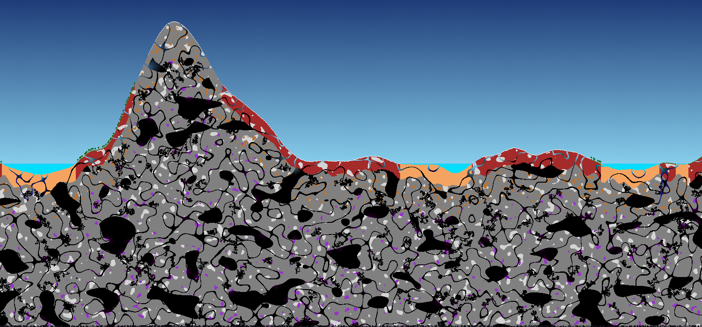

# WorldGenerator

A procedural 2D world generation tool built with JavaFX, developed as a final project at Goldsmiths, University of London.

Generate pixel-art worlds with configurable terrain, biomes, caves, water, decorations, and ore deposits, all driven by a seed value for reproducibility. A real-time interactive viewport lets you pan and zoom around the generated world, and configurations can be saved and loaded as `.world` files.


> _Screenshot placeholder — replace with an actual screenshot of the application._

---

## Features

- **Procedural terrain** — layered heightmap system where multiple generators (currently noise and stepped) can be combined using additive, average, highest, lowest, or noise-blend modes; extensible with new generator types
- **Biomes** — Plains, Desert, Forest, Tundra, Beach, Ocean, Lake, Mountain, and Mountain Peak, assigned by noise with height-based overrides
- **Cave generation** — three algorithms that can be use in combination: Cellular Automata, Simplex Noise, and Drunkard's Walk.
- **Water simulation** — pressure-based flood fill that naturally fills caves below the water level; bodies classified as lakes or oceans by width
- **Decorations** — trees, flowers, mushrooms, houses, seaweed, and more, placed probabilistically with biome and surface constraints, the program also allows users to create their own decoration objects with custom shapes.
- **Ores & substances** — Coal, Diamond, Copper, Lapis, Amethyst, Gravel, Clay, Quartz, and Red Clay distributed by depth and noise thresholds. The program also allows users to generate their own rule for placing down different tile types similar to how ores are distributed.
- **Save / Load** — world configurations serialised to JSON `.world` files for sharing and reproducibility
- **Interactive viewport** — WASD / middle-mouse pan, scroll to zoom, with a chunk-based renderer at high zoom and a cached full-world image at low zoom

---

## Prerequisites

- Java 21 JDK
- Apache Maven 3.8+

---

## Getting Started

```bash
# Clone the repository
git clone https://github.com/zombonline/WorldGenerator.git
cd WorldGenerator

# Run the application
mvn clean javafx:run
```

---

## Usage

1. Adjust generation parameters in the left panel (seed, heightmap, biomes, caves, water, decorations, substances).
2. Click **Generate** to regenerate the world with the current settings.
3. Pan with **WASD** or **middle-mouse drag**; zoom with the **scroll wheel**.
4. Use **File → Save** / **File → Load** to persist configurations as `.world` files.

---

## Architecture

World generation runs as six sequential passes:

| Pass | What it does |
|------|-------------|
| **Heightmap** | Builds surface elevation from composite noise groups |
| **Biome** | Assigns tile types per biome based on noise and height overrides |
| **Substance** | Replaces stone tiles with ores using depth and noise thresholds |
| **Caves** | Carves empty space using one or more cave generator instances |
| **Water** | Floods caves below water level using a pressure-based algorithm |
| **Decorations** | Places decorative objects respecting biome, surface, and placement rules |

Each tile's final type is resolved lazily by `World.getTile()`, which applies the enabled passes in order.

---

## Tech Stack

| Library | Version | Purpose |
|---------|---------|---------|
| JavaFX | 21 | UI framework and canvas rendering |
| OpenSimplexNoise | 1.0.3 | Noise for terrain, biomes, and ores |
| GSON | 2.10.1 | JSON serialisation for `.world` save files |
| GemsFX | 2.16.0 | Enhanced JavaFX UI components |
| JUnit 5 | 5.10.2 | Testing |

---

## License

MIT License — see [LICENSE](LICENSE) for details.
